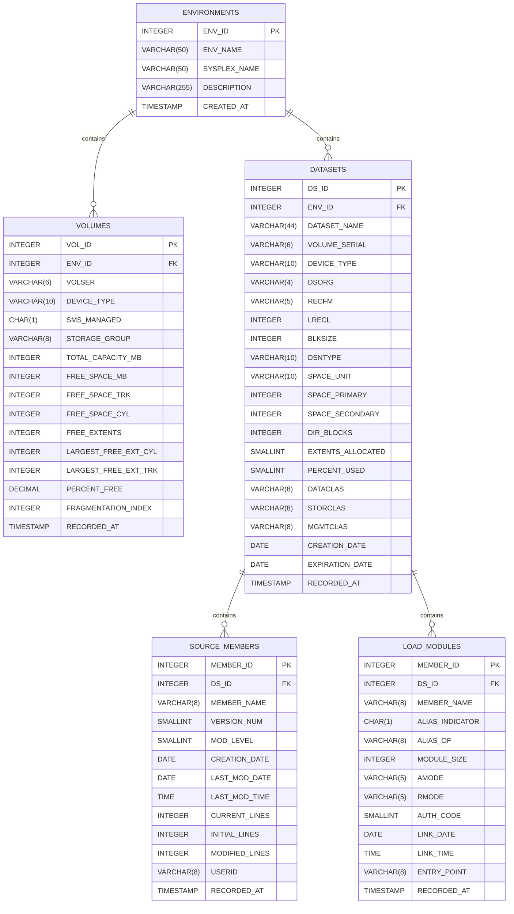

# Mainframe Software Quality Dashboard - Data Model Documentation

This document describes the data model for the Mainframe Software Quality Dashboard, based on the DB2 schema.

https://www.ibm.com/support/pages/apar/OA66032

## Entity Relationship Diagram

## Data Dictionary

### 1. `ENVIRONMENTS`
Represents the target mainframe environments (e.g., Development, Test, Production) from which software quality metrics and dataset information are collected.

| Column Name | Data Type | Constraints | Description |
| :--- | :--- | :--- | :--- |
| `ENV_ID` | INTEGER | PRIMARY KEY | Unique identifier for the environment (Auto-generated). |
| `ENV_NAME` | VARCHAR(50) | NOT NULL | Name of the environment. |
| `SYSPLEX_NAME` | VARCHAR(50) | NOT NULL | Sysplex name associated with the environment. |
| `DESCRIPTION` | VARCHAR(255) | | Optional description of the environment. |
| `CREATED_AT` | TIMESTAMP | DEFAULT CURRENT TIMESTAMP | Timestamp indicating when the environment record was created. |

### 2. `DATASETS`
Captures dataset allocation and SMS attributes. Maps to datasets (PDS or PDS/E) residing within a specific environment.

* **Unique Constraint**: `(DATASET_NAME, ENV_ID)` ensures a dataset name is unique within an environment.

| Column Name | Data Type | Constraints | Description |
| :--- | :--- | :--- | :--- |
| `DS_ID` | INTEGER | PRIMARY KEY | Unique identifier for the dataset (Auto-generated). |
| `ENV_ID` | INTEGER | FOREIGN KEY | References `ENVIRONMENTS(ENV_ID)`. Cascade on delete. |
| `DATASET_NAME` | VARCHAR(44) | NOT NULL | Standard MVS dataset name (max length 44). |
| `VOLUME_SERIAL` | VARCHAR(6) | | Volume serial number (VOLSER). |
| `DEVICE_TYPE` | VARCHAR(10) | | Device type (e.g., '3390', 'SYSDA'). |
| `DSORG` | VARCHAR(4) | | Dataset organization ('PO' or 'PO-E'). |
| `RECFM` | VARCHAR(5) | | Record format ('FB', 'VB', 'U', etc.). |
| `LRECL` | INTEGER | | Logical record length. |
| `BLKSIZE` | INTEGER | | Block size. |
| `DSNTYPE` | VARCHAR(10) | | Dataset type (e.g., 'PDS', 'LIBRARY'). |
| `SPACE_UNIT` | VARCHAR(10) | | Space allocation unit ('TRK', 'CYL', 'BLK'). |
| `SPACE_PRIMARY` | INTEGER | | Primary space quantity. |
| `SPACE_SECONDARY` | INTEGER | | Secondary space quantity. |
| `DIR_BLOCKS` | INTEGER | | Number of directory blocks (standard PDS). |
| `EXTENTS_ALLOCATED` | SMALLINT | | Number of used extents or volumes. |
| `PERCENT_USED` | SMALLINT | | Percentage of allocated space that is used. |
| `DATACLAS` | VARCHAR(8) | | SMS Data Class. |
| `STORCLAS` | VARCHAR(8) | | SMS Storage Class. |
| `MGMTCLAS` | VARCHAR(8) | | SMS Management Class. |
| `CREATION_DATE` | DATE | | Dataset creation date. |
| `EXPIRATION_DATE` | DATE | | Dataset expiration date. |
| `RECORDED_AT` | TIMESTAMP | DEFAULT CURRENT TIMESTAMP | Timestamp indicating when this dataset record was logged. |

### 3. `SOURCE_MEMBERS`
Stores PDS/PDS-E directory attributes and ISPF statistics associated with source code members.

* **Unique Constraint**: `(MEMBER_NAME, DS_ID)` ensures member names are unique per dataset.

| Column Name | Data Type | Constraints | Description |
| :--- | :--- | :--- | :--- |
| `MEMBER_ID` | INTEGER | PRIMARY KEY | Unique identifier for the source member (Auto-generated). |
| `DS_ID` | INTEGER | FOREIGN KEY | References `DATASETS(DS_ID)`. Cascade on delete. |
| `MEMBER_NAME` | VARCHAR(8) | NOT NULL | 1-8 character member name. |
| `VERSION_NUM` | SMALLINT | | ISPF Version Number (VV). |
| `MOD_LEVEL` | SMALLINT | | ISPF Modification Level (MM). |
| `CREATION_DATE` | DATE | | ISPF Creation Date. |
| `LAST_MOD_DATE` | DATE | | Date the member was last changed. |
| `LAST_MOD_TIME` | TIME | | Time the member was last changed. |
| `CURRENT_LINES` | INTEGER | | Current size/line count of the member. |
| `INITIAL_LINES` | INTEGER | | Initial line count of the member. |
| `MODIFIED_LINES`| INTEGER | | Number of lines modified. |
| `USERID` | VARCHAR(8) | | User ID who last modified the member. |
| `RECORDED_AT` | TIMESTAMP | DEFAULT CURRENT TIMESTAMP | Timestamp indicating when this member's stats were recorded. |

### 4. `LOAD_MODULES`
Captures attributes and linkage editor/binder statistics for compiled load modules (typically `RECFM=U`).

* **Unique Constraint**: `(MEMBER_NAME, DS_ID)` ensures load module names are unique per dataset.

| Column Name | Data Type | Constraints | Description |
| :--- | :--- | :--- | :--- |
| `MEMBER_ID` | INTEGER | PRIMARY KEY | Unique identifier for the load module (Auto-generated). |
| `DS_ID` | INTEGER | FOREIGN KEY | References `DATASETS(DS_ID)`. Cascade on delete. |
| `MEMBER_NAME` | VARCHAR(8) | NOT NULL | 1-8 character module name. |
| `ALIAS_INDICATOR`| CHAR(1) | | Indicates if the entry is an alias ('Y') or primary module ('N'). |
| `ALIAS_OF` | VARCHAR(8) | | The primary member name this alias points to. |
| `MODULE_SIZE` | INTEGER | | Size of the module in bytes/hex. |
| `AMODE` | VARCHAR(5) | | Addressing Mode (e.g., '24', '31', '64', 'ANY'). |
| `RMODE` | VARCHAR(5) | | Residency Mode (e.g., '24', 'ANY'). |
| `AUTH_CODE` | SMALLINT | | Authorization Code/AC. |
| `LINK_DATE` | DATE | | Date the module was link-edited. |
| `LINK_TIME` | TIME | | Time the module was link-edited. |
| `ENTRY_POINT` | VARCHAR(8) | | Main entry point of the module. |
| `RECORDED_AT` | TIMESTAMP | DEFAULT CURRENT TIMESTAMP | Timestamp indicating when this module's stats were recorded. |

### 5. `VOLUMES`
Captures z/OS DASD volume capacity and free space metrics. Usually populated via IDCAMS DCOLLECT (V records) or REXX routines querying VTOCs.

* **Unique Constraint**: `(VOLSER, ENV_ID)` ensures volume serials are unique per environment.

| Column Name | Data Type | Constraints | Description |
| :--- | :--- | :--- | :--- |
| `VOL_ID` | INTEGER | PRIMARY KEY | Unique identifier for the volume (Auto-generated). |
| `ENV_ID` | INTEGER | FOREIGN KEY | References `ENVIRONMENTS(ENV_ID)`. Cascade on delete. |
| `VOLSER` | VARCHAR(6) | NOT NULL | Volume serial number (1-6 characters). |
| `DEVICE_TYPE` | VARCHAR(10) | | Device type (e.g., '3390'). |
| `SMS_MANAGED` | CHAR(1) | | Indicates if the volume is SMS managed ('Y' or 'N'). |
| `STORAGE_GROUP` | VARCHAR(8) | | SMS storage group name, if applicable. |
| `TOTAL_CAPACITY_MB` | INTEGER | | Total capacity in Megabytes. |
| `FREE_SPACE_MB` | INTEGER | | Total free space in Megabytes. |
| `FREE_SPACE_TRK` | INTEGER | | Total free space in Tracks. |
| `FREE_SPACE_CYL` | INTEGER | | Total free space in Cylinders. |
| `FREE_EXTENTS` | INTEGER | | Total number of free space extents on the volume. |
| `LARGEST_FREE_EXT_CYL`| INTEGER | | The size of the largest single free extent in Cylinders. |
| `LARGEST_FREE_EXT_TRK`| INTEGER | | The size of the largest single free extent in Tracks. |
| `PERCENT_FREE` | DECIMAL(5,2)| | Percentage of volume capacity that is free. |
| `FRAGMENTATION_INDEX` | INTEGER | | Measure of free space fragmentation (e.g., from DCOLLECT). |
| `RECORDED_AT` | TIMESTAMP | DEFAULT CURRENT TIMESTAMP | Timestamp indicating when these volume metrics were recorded. |
